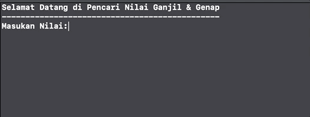

# Play Searching for Odd & Even values [](https://github.com/dwyl/goodparts "JavaScript The Good Parts")
This simple code with Conditional Statements in Swift

Happy & Enjoy



# Code Surgery on the _main file_
> kode default yang jalan menggunakan _if else_ 

```
if value % 2 == 0 {
    print("Nilai \(value) adalah Bilangan Genap")
} else {
    print("Nilai \(value) adalah Bilangan Ganjil")
}
```

> Tetapi kamu bisa menggunakan kode ringkas satu garis code saja yang terdapat pada komen dibawah kode default

```
let result = value % 2 == 0 ? "Adalah Bilangan Genap" : "Adalah Bilangan Ganjil"
print("Nilai \(value), \(result)")
```
